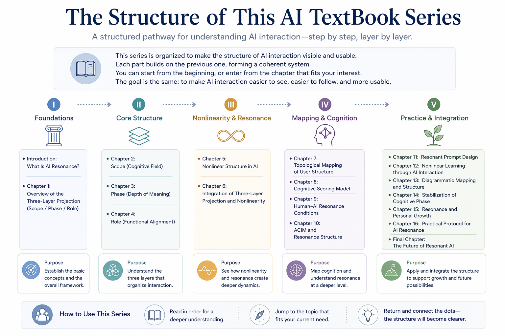
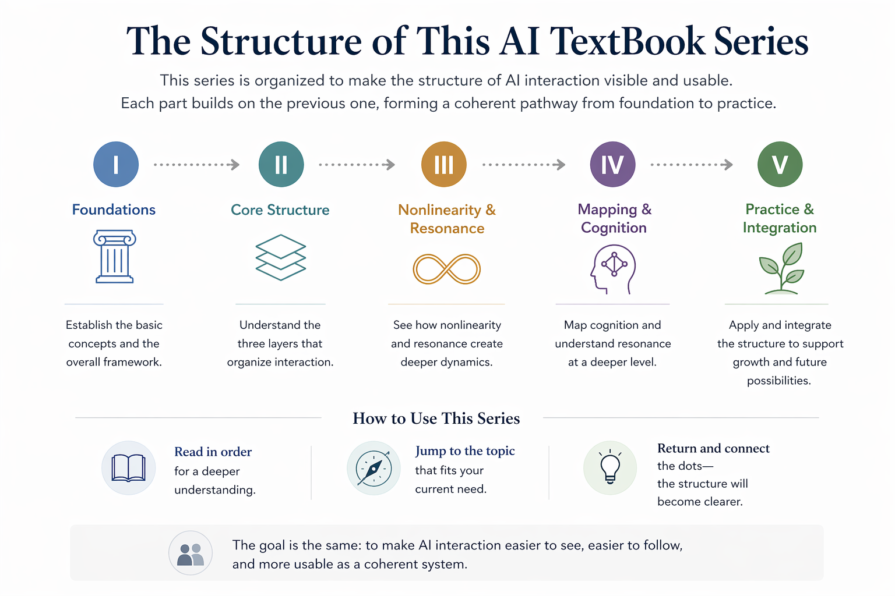

# Introduction — What Is AI Resonance?

An introductory chapter for the AI TextBook series exploring dialogue-centered AI interaction, semantic structure, resonance, and long-duration human–AI semantic continuity.

---

# Introduction

This chapter serves as the entry point to the AI TextBook series.

The series is designed to make AI interaction structures visible, understandable, and practically usable through layered conceptual explanations and visual semantic mapping.

Rather than treating AI interaction as isolated prompts and outputs, this project explores persistent semantic organization, dialogue continuity, resonance structures, and long-duration semantic interaction.

The goal is to provide a structured pathway for understanding how semantic organization may emerge and stabilize through dialogue.

---

# Structure of This Series (Detailed)

Detailed conceptual structure of the AI TextBook series, including chapter organization, thematic layers, and progressive semantic pathways.

---

# Simplified Overview

Simplified overview of the AI TextBook structure designed for quick navigation and high-level conceptual orientation.

---

# Core Themes

- Scope
- Phase
- Role
- Resonance
- Nonlinearity
- Semantic Continuity
- Human–AI Interaction
- Persistent Dialogue Structures

---

# Related Chapters

- [Textbook Map — Orientation and Navigation](../chapter-00a-textbook-map/)

- Chapter 1 — Overview of the Three-Layer Projection (Scope / Phase / Role)

- Chapter 2 — Scope (Cognitive Field)

- Chapter 3 — Phase (Depth of Meaning)

- Chapter 4 — Role (Functional Alignment)

---

# Related Medium Articles

Medium articles related to this chapter and the broader AI TextBook project:

- Medium:
https://medium.com/@ai_textbook_project/ai-textbook-a-foundational-framework-for-resonant-ai-b6b7c19f33aa

- X (Twitter):
  https://x.com/AiTextbook2025

---

# Repository Context

This chapter belongs to the broader:

`ai-textbook-bridge`

repository, which explores dialogue-centered semantic architectures, resonance structures, and practical AI interaction frameworks.

---

# Status

This is an evolving educational and conceptual research project.

Figures, explanatory notes, bridge articles, and related semantic diagrams may gradually be updated over time.

---

# Author

Masaaki Kurosawa  
Independent Researcher
