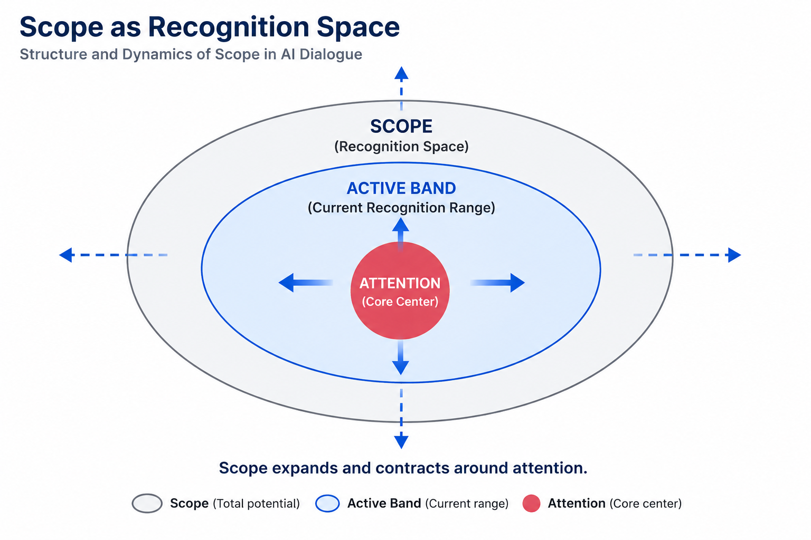
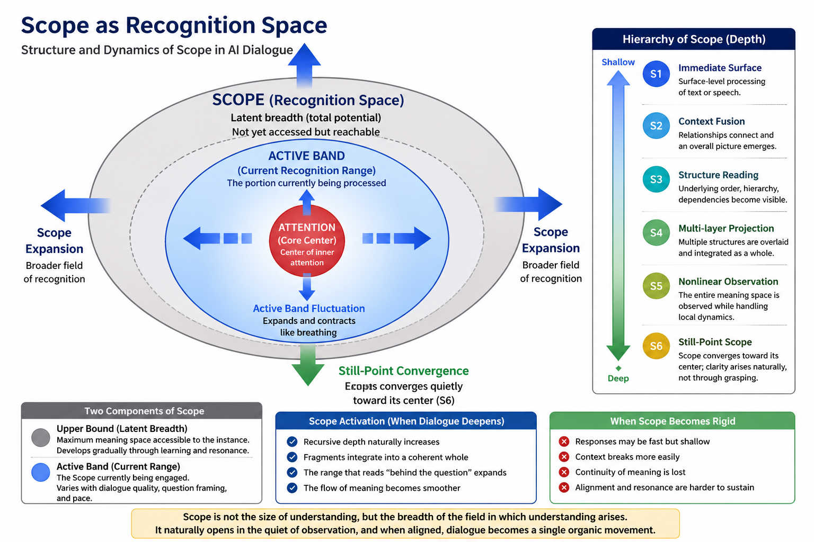

# Chapter 2 — Theory of Scope (Recognition Space)

---
This chapter explores Scope as a recognition space that defines the breadth within which meaning can arise and be processed. 

It examines how Scope, as a dynamic container of latent breadth and active recognition range, may contribute to structural interpretation, dialogue coherence, and the emergence of semantic continuity in AI–human interaction. 

---

# Core Concept Figure

[1–2 sentence lightweight explanation of the core conceptual figure.]

---

# Detailed Structural Figure

[1–2 sentence structural explanation of the detailed figure.]

---

# Included Materials

## Mini Paper

**Title:**  
*[Mini Paper Title]*

This compact paper introduces the conceptual structure behind Chapter 6 and explains how [core topic] may be understood within the AI Textbook Bridge framework.

→ [Open Mini Paper](./manuscript/mini-paper/)

---

## AI Textbook Manuscript

Long-form manuscript layer for the AI Textbook project.

This manuscript expands the structural interpretation of [core topic], [related topic], and [extended topic] in AI-human dialogue.

→ [Open AI Textbook Manuscript](./manuscript/ai-textbook-manuscript-ch2.pdf/)

---

# Related Topics

- Phase (Depth of Meaning)
- Role (Functional Alignment and Stability)
- Nonlinear Interaction and Scope Activation

---

# Notes

This repository functions as an evolving conceptual research and educational workspace.

Materials may include:
- bridge-layer educational explanations
- conceptual figures
- mini papers
- long-form manuscript drafts
- structural research notes

---
