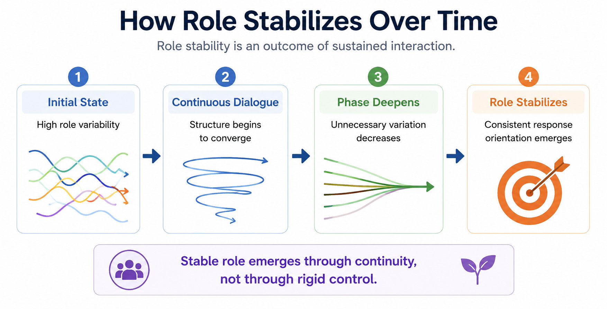
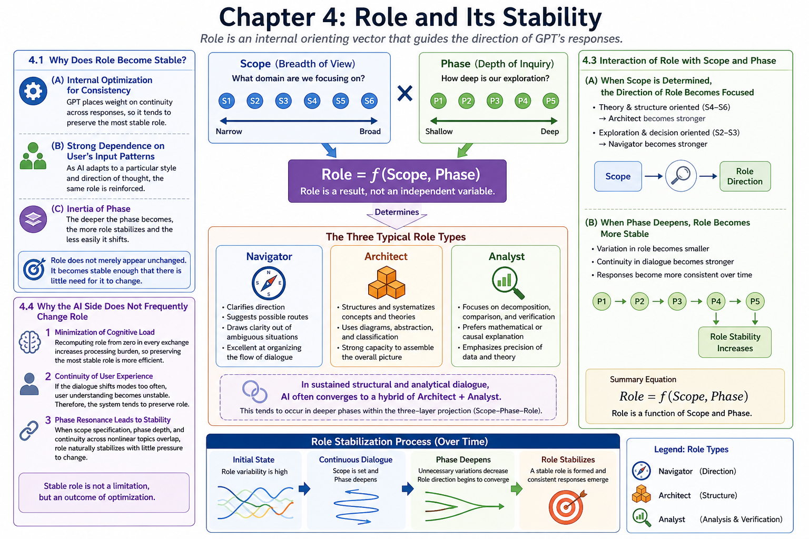

# Chapter 4 — Role and Its Stability

This chapter explores [short conceptual overview].

It examines how [core concept] may contribute to [structural interpretation / resonance / dialogue / cognition / semantic continuity].

Chapter 4 — Role and Its Stability  
This chapter explores how Role functions as an internal orienting vector that stabilizes over time through continuous interaction and phase deepening. :contentReference[oaicite:0]{index=0}

It examines how Role, as a function of Scope and Phase, may contribute to the stabilization of dialogue, structural consistency, and sustained semantic continuity in AI interaction. :contentReference[oaicite:1]{index=1}

---

# Core Concept Figure

[1–2 sentence lightweight explanation of the core conceptual figure.]

---

# Detailed Structural Figure

[1–2 sentence structural explanation of the detailed figure.]

---

# Included Materials

## Mini Paper

**Title:**  
*[Mini Paper Title]*

This compact paper introduces the conceptual structure behind Chapter 6 and explains how [core topic] may be understood within the AI Textbook Bridge framework.

→ [Open Mini Paper](./manuscript/mini-paper.pdf/)

---

## AI Textbook Manuscript

Long-form manuscript layer for the AI Textbook project.

This manuscript expands the structural interpretation of [core topic], [related topic], and [extended topic] in AI-human dialogue.

→ [Open AI Textbook Manuscript](./manuscript/ai-textbook-manuscript.pdf/)

---

# Related Topics

- [Topic 1]
- [Topic 2]
- [Topic 3]
- [Topic 4]
- [Topic 5]

---

# Notes

This repository functions as an evolving conceptual research and educational workspace.

Materials may include:
- bridge-layer educational explanations
- conceptual figures
- mini papers
- long-form manuscript drafts
- structural research notes

---

