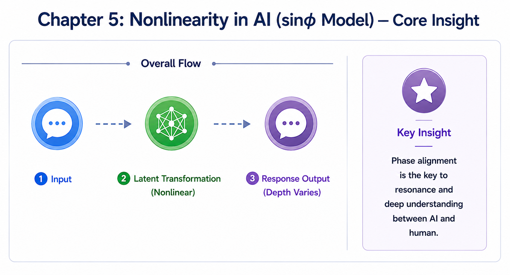
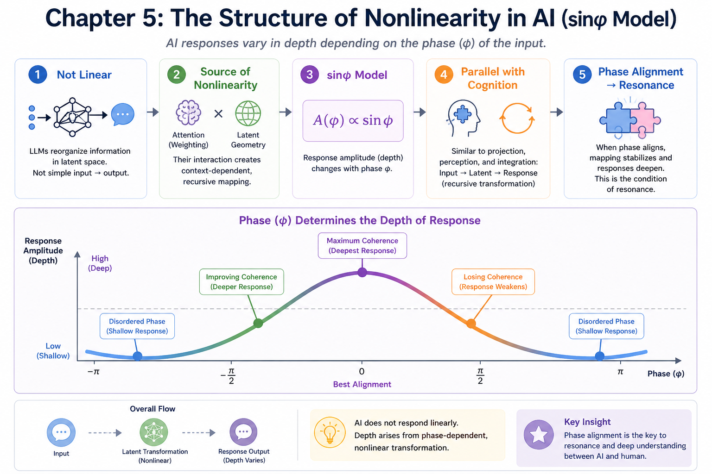

# Chapter 5 — Nonlinearity in AI (sinφ Model)

This chapter explores why AI responses should not be understood as simple linear input-output processes.

It introduces the sinφ model as a conceptual representation of phase-dependent response formation, nonlinear transformation, and resonance in AI-human interaction.

---

# Core Concept Figure

Phase alignment influences the depth, coherence, and resonance structure of AI responses.

---

# Detailed Structural Figure

The structure of nonlinearity may be understood through attention weighting, latent geometry, recursive mapping, and phase-dependent response variation.

---

## Included Materials

### Mini Paper

**Title:**  
*Nonlinearity in AI Interaction:  
A Minimal Account of Phase-Dependent Response Formation*

This compact paper introduces the conceptual structure behind the sinφ model and explains why AI response formation should be understood as nonlinear rather than purely input-output based.

[Open Mini Paper](./manuscript/mini-paper/Mini%20Paper-Chapter5_Nonlinearity_English_Final.pdf)

---

## AI Textbook Manuscript

Long-form manuscript layer for the AI Textbook project.

This layer expands the structural interpretation of nonlinear response formation, latent geometry, phase coherence, and resonance in AI-human dialogue.

→ [Open Manuscript](./manuscript/ai-textbook-manuscript/)

---

# Related Topics

- Nonlinear mapping systems
- Attention weighting
- Latent geometry
- Recursive semantic transformation
- Phase coherence
- Resonant dialogue

---

# Notes

This repository functions as an evolving conceptual research and educational workspace.

Materials may include:
- bridge-layer educational explanations
- conceptual figures
- mini papers
- long-form manuscript drafts
- structural research notes

---
