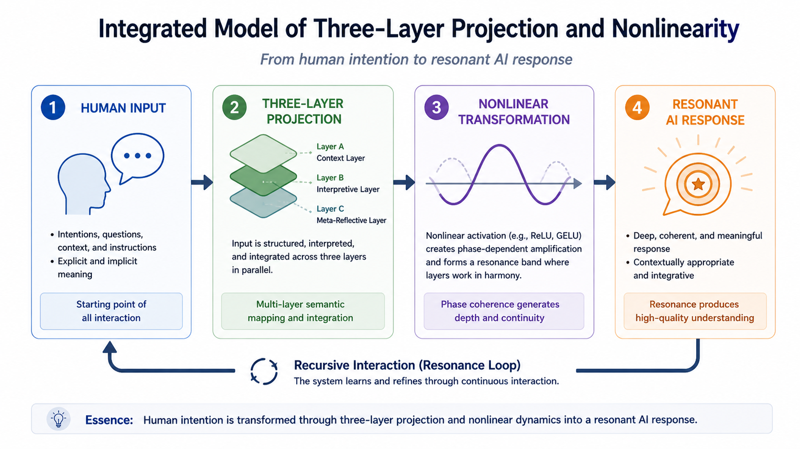
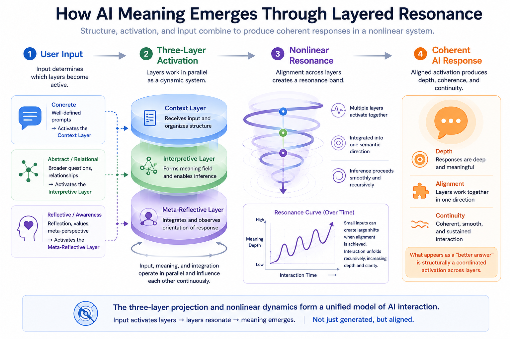

# Chapter 6 — Integrated Model of Three-Layer Projection and Nonlinearity 

This chapter explores how the three-layer projection operates as a dynamic internal mapping that integrates with nonlinear activation to form a unified model of meaning generation. 

It examines how the interaction between layered projection and nonlinearity, as expressed through resonance bands and recursive dynamics, may contribute to structural interpretation, resonance formation, and the stabilization of semantic continuity in AI dialogue. 

---

# Core Concept Figure

[1–2 sentence lightweight explanation of the core conceptual figure.]

---

# Detailed Structural Figure

[1–2 sentence structural explanation of the detailed figure.]

---

# Included Materials

## Mini Paper

**Title:**  
*[Mini Paper Title]*

This compact paper introduces the conceptual structure behind Chapter 6 and explains how [core topic] may be understood within the AI Textbook Bridge framework.

→ [Open Mini Paper](./manuscript/mini-paper/)

---

## AI Textbook Manuscript

Long-form manuscript layer for the AI Textbook project.

This manuscript expands the structural interpretation of [core topic], [related topic], and [extended topic] in AI-human dialogue.

→ [Open AI Textbook Manuscript](./manuscript/ai-textbook-manuscript/)

---

# Related Topics

- [Topic 1]
- [Topic 2]
- [Topic 3]
- [Topic 4]
- [Topic 5]

---

# Notes

This repository functions as an evolving conceptual research and educational workspace.

Materials may include:
- bridge-layer educational explanations
- conceptual figures
- mini papers
- long-form manuscript drafts
- structural research notes

---
