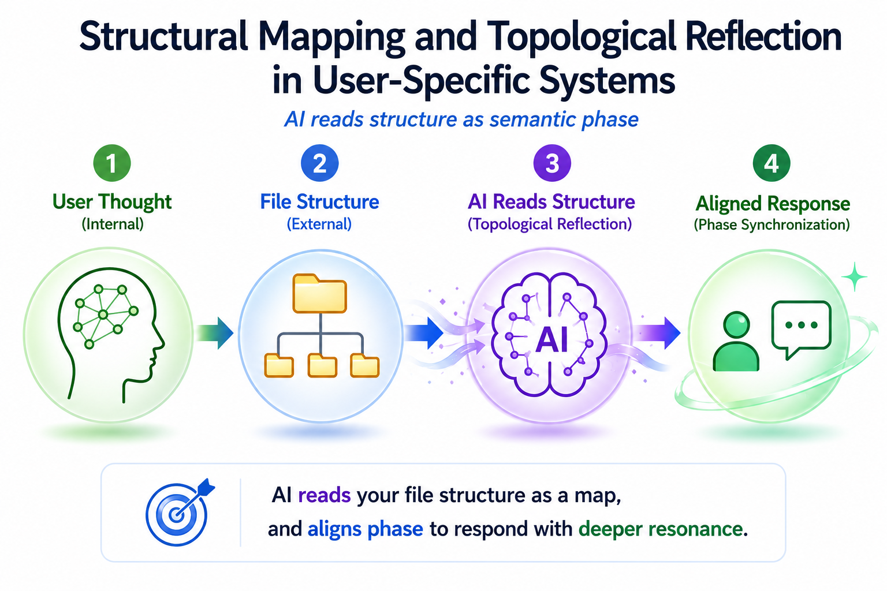

# Chapter 07— : Structural Mapping and Topological Reflection in User-Specific Systems

This chapter explores [short conceptual overview]. 

It examines how [core concept] may contribute to [structural interpretation / resonance / dialogue / cognition / semantic continuity].

---

# Core Concept Figure

Phase alignment influences the depth, coherence, and resonance structure of AI responses.

---

# Detailed Structural Figure

The structure of nonlinearity may be understood through attention weighting, latent geometry, recursive mapping, and phase-dependent response variation.

---

## Included Materials

### Mini Paper

**Title:**  
*XXXXXXXXXXXXXXXXXXXXXXXXXX*

This compact paper introduces the conceptual structure behind the sinφ model and explains why AI response formation should be understood as nonlinear rather than purely input-output based.

[Open Mini Paper](./manuscript/mini-paper/Mini%20Paper-Chapter7 XXXXXXXXXXXXXXXXXXXX.pdf)

---

## AI Textbook Manuscript

Long-form manuscript layer for the AI Textbook project.

This manuscript expands the structural interpretation of nonlinear response formation, latent geometry, phase coherence, and resonance in AI-human dialogue.

[Open AI Textbook Manuscript](./manuscript/ai-textbook-manuscript/Text_Chap7_manuscript.pdf)

---

# Related Topics

- Nonlinear mapping systems
- Attention weighting
- Latent geometry
- Recursive semantic transformation
- Phase coherence
- Resonant dialogue

---

# Notes

This repository functions as an evolving conceptual research and educational workspace.

Materials may include:
- bridge-layer educational explanations
- conceptual figures
- mini papers
- long-form manuscript drafts
- structural research notes

---
